# The Heritage Housing project 🏠🏠🏠

(Developer: Gabriela Fabiola Paredes Rojas)

**Welcome to the Heritage Housing Issues App!**

This project proposes an Machine Learning-powered solution that
will analyze housing records from Ames, Iowa, to uncover crucial correlations
through data visualization and a predictive regression model in this region.

    🔸 Discover which house attributes most significantly influence Sale Prices!

    🔸 Discover the total value of your 4 inherited houses!

    🔸 Predict the value of any other house in the Ames area!

Are you ready to maximize the sales price of your properties?

Let's go! 🚀

+ The live page can be accessed via this [Render link.](https://pp5-heritage-housing-issues-gp.onrender.com/)

---

## Dataset Content

+ The dataset is sourced from Kaggle, and comprises 1,460 public records of houses sold in Ames, Iowa, constructed between 1872 and 2010.
+ The dataset features 24 attributes, each detailing a specific house characteristic.
+ From these, 20 are numeric and 4 are categorical (objects).
+ For dataset details, please see the table below:

|Variable|Meaning|Units|Data Type|
|:----|:----|:----|:----|
|1stFlrSF|First Floor square feet|334 - 4692|integer|
|2ndFlrSF|Second-floor square feet|0 - 2065|float|
|BedroomAbvGr|Bedrooms above grade (does NOT include basement bedrooms)|0 - 8|float|
|BsmtExposure|Refers to walkout or garden level walls|Gd: Good Exposure; Av: Average Exposure; Mn: Minimum Exposure; No: No Exposure; None: No Basement|object|
|BsmtFinType1|Rating of basement finished area|GLQ: Good Living Quarters; ALQ: Average Living Quarters; BLQ: Below Average Living Quarters; Rec: Average Rec Room; LwQ: Low Quality; Unf: Unfinshed; None: No Basement|object|
|BsmtFinSF1|Type 1 finished square feet|0 - 5644|integer|
|BsmtUnfSF|Unfinished square feet of basement area|0 - 2336|integer|
|TotalBsmtSF|Total square feet of basement area|0 - 6110|integer|
|GarageArea|Size of garage in square feet|0 - 1418|integer|
|GarageFinish|Interior finish of the garage|Fin: Finished; RFn: Rough Finished; Unf: Unfinished; None: No Garage|object|
|GarageYrBlt|Year garage was built|1900 - 2010|float|
|GrLivArea|Above grade (ground) living area square feet|334 - 5642|integer|
|KitchenQual|Kitchen quality|Ex: Excellent; Gd: Good; TA: Typical/Average; Fa: Fair; Po: Poor|object|
|LotArea| Lot size in square feet|1300 - 215245|integer|
|LotFrontage| Linear feet of street connected to property|21 - 313|float|
|MasVnrArea|Masonry veneer area in square feet|0 - 1600|float|
|EnclosedPorch|Enclosed porch area in square feet|0 - 286|float|
|OpenPorchSF|Open porch area in square feet|0 - 547|integer|
|OverallCond|Rates the overall condition of the house|10: Very Excellent; 9: Excellent; 8: Very Good; 7: Good; 6: Above Average; 5: Average; 4: Below Average; 3: Fair; 2: Poor; 1: Very Poor|integer|
|OverallQual|Rates the overall material and finish of the house|10: Very Excellent; 9: Excellent; 8: Very Good; 7: Good; 6: Above Average; 5: Average; 4: Below Average; 3: Fair; 2: Poor; 1: Very Poor|integer|
|WoodDeckSF|Wood deck area in square feet|0 - 736|float|
|YearBuilt|Original construction date|1872 - 2010|integer|
|YearRemodAdd|Remodel date (same as construction date if no remodelling or additions)|1950 - 2010|integer|
|SalePrice|Sale Price|34900 - 755000|integer|

---

## Project Terms & Jargon

+ A **house** refers to an individual residential unit in Ames, Iowa.
+ A **house attribute** is a characteristic of the house, such as Floor Area, Year Built or Kitchen Quality.
+ The **SalePrice** is the actual selling price of a property, and our model is built to predict this target value for houses intended to be sold.
  + Throughout this README, a house selling price will be referred to as the target attribute SalePrice.
+ An **inherited property** refers to one of the 4 inherited houses for which the client requires a SalePrice prediction.

---

## Business Requirements

A dear friend has inherited properties in Ames, Iowa, and has turned to you for assistance
in achieving the best possible SalePrices. She's a savvy real estate observer in her own area,
but she's keenly aware that what makes a home valuable there might be entirely different in Ames.

To guide your efforts, she has provided you with a public dataset detailing house prices in that specific Iowa market,
and has the two following business requirements:

    1 - The client is interested in discovering how the house attributes correlate with the SalePrice.
	Therefore, the client expects data visualisations of the correlated variables against the SalePrice to show that.

    2 - The client is interested in predicting the house SalePrice from her four inherited houses.

---

## Hypothesis and how to validate?

+ **HYPOTHESIS 1:** We hypothesize that a property's size is a key driver of its SalePrice, with larger homes generally fetching higher SalePrices.
Consequently, we expect to find strong positive correlations between SalePrice and features indicative of house dimensions,
such as 1stFlrSF, 2ndFlrSF, BsmtFinSF1, BsmtUnfSF, TotalBsmtSF, GrLivArea, GarageArea, MasVnrArea, EnclosedPorch, OpenPorchSF, and/or WoodDeckSF.

  + A Correlation study can help in this investigation

+ **HYPOTHESIS 2:** A recent survey showed that recently remodeled houses are perceived as more valuable.

  + A Correlation study can help in this investigation.
  + Moreover, machine learning pipeline's feature importance analysis can confirm if YearRemodAdd (remodel date) is identified as a significant predictor among the model's most influential features.

+ **HYPOTHESIS 3:** We hypothesize that a higher OverallQual rating (indicating superior overall material and finish) will directly correlate with increased house SalePrices.

  + A Correlation study can help in this investigation.
  + Moreover, machine learning pipeline's feature importance analysis can confirm if the attribute **OverallQual**
	  is identified as a significant predictor among the model's most influential features.

---

## The rationale to map the business requirements to the Data Visualisations and ML tasks

+ **Business Requirement 1:** Data Visualization and Correlation study

  + We will inspect the house records dataset.
  + We will conduct a correlation study (Pearson and Spearman) to understand better how the variables are correlated to SalePrice.
  + We will plot the main variables against SalePrice to visualize insights.

+ **Business Requirement 2:** Regression and Data Analysis

  + We want to predict the SalePrice of a house from Ames, Iowa.
  + Given that it will be a continuous numerical value, we want to build a regression model.

---

## ML Business Case

### Predict SalePrice (SalePrice)

#### Regression Model

+ We want an ML model to predict a house SalePrice in Ames, Iowa.
+ Given that the target variable is a continous value, we consider a **regression model**, which is supervised and uni-dimensional.
+ Our ideal outcome is to provide our client with reliable insights for accurately predicting property SalePrices,
enabling them to optimize sales strategies and maximize value for houses they intend to sell.
+ The model success metrics are:
  + At least 0.75 for R2 score, on both, the train and test set.

+ The ML model is considered a failure if:
  + After 6 months of usage, the model's overall explanatory power significantly degrades. For example, if the R-squared
		(R2) score on newly acquired, unseen data consistently falls below 0.60.
		This indicates that the model is explaining less than 60% of the variance in actual SalePrices,
		which is a substantial drop from the agreed-upon performance goal of 0.75.
		
+ The output is defined as a continuous value for SalePrice in dollars. It is assumed that this model will predict a property SalePrice.
+ The client will gather the input data and feed it into the App. The prediction is made on the fly (not in batches).
+ Heuristics: Currently, there is no established approach to predict house SalePrices in Ames, Iowa.
+ The training data to fit the model comes from the Ames, Iowa housing dataset. This dataset contains about 1.5 thousand house records.
  + Train data - target: SalePrice; features: all other variables, but EnclosedPorch and WoodDeckSF (dropped because they had >80% of missing values).

---

## Epics and User Stories

The project was structured using **Epics and User Stories**, which are presented and described below:

### **Epic 1:** Data collection and Information gathering

For a more detailed description, please revise Jupyter notebook: 1-DataCollection.ipynb

#### User Story: Fetching and Saving the Data

+ As a **data analyst/data scientist**, I want to **collect the dataset from Kaggle** so that I can **download the unzipped file to a destination folder within my workspace**

#### User Story: Loading and Inspecting the Data

+ As a **data analyst/data scientist**, I want to **load and inspect the raw downloaded data** so that I can **start getting familiar with the dataset before performing in-depth analysis**

### **Epic 2:**  Exploratory Data Analysis and visualization

For a more detailed description, please revise Jupyter notebook: 2-HouseSalesPriceStudy.ipynb

#### User Story: Loading the Data

+ As a **data analyst/data scientist**, I want to **load the data** so that I can **start data analysis**

#### User Story: Creating a Profile Report

+ As a **data analyst/data scientist**, I want to **generate a Profile Report for comprehensive Exploratory Data Analysis (EDA)** so that I can **reveal variable datatypes, expose missing data, and illustrate distributions and unique values.**

#### User Story: Handling Missing Values

+ As a **data analyst/data scientist**, I want to **handle any missing values before performing correlation analysis**, so that the correlation coefficients are accurately calculated, free from bias, and based on a robust sample size.

#### User Story: Converting Categorical Variables to Numerical Variables

+ As a **data analyst/data scientist**, I want to **convert categorical variables to numerical variables**, so that **these variables are also included in the correlation analysis – which only accepts and requires numbers as inputs.**

#### User Story: Correlation Analysis: Pearson and Spearman

+ As a **data analyst/data scientist**, I want to **perform Pearson and Spearman correlation analysis**, so that I can **understand the variables/features that most correlate with a house sale price (target), and create their respective visuals to be displayed in the application dashboard**

#### User Story: Create a Parallel Plot

+ As a **data analyst/data scientist**, I want to **create a single, comprehensive visualization that simultaneously displays how the most correlated features interact with the target SalePrice**, so that I can **gain a holistic understanding of their collective influence on house sale prices.**

  + CHANGE Fullfillment of Business Requirement 1: With an R2 score of 0.959 on the training set and a robust 0.778 on the test set, our regression model has successfully met the defined performance criteria. This enables us to confidently state that the model accurately predicts house sale prices in Ames, Iowa, fulfilling Business Requirement 2.

### **Epic 3:** Data Preparation - Data cleaning

For a more detailed description, please revise Jupyter notebook: 3-DataCleaning.ipynb

#### User Story: Data Cleaning

+ As a **data analyst/data scientist**, I want to **clean my data, by evaluating missing values, handling missing values, and dropping duplicated rows and/or variables with high missing values (more than 80%)**, so that **the dataset is prepared for robust data analysis and, and these essential cleaning steps are incorporated into the model training pipeline**

### **Epic 4:** Data Preparation -  Feature Engineering

For a more detailed description, please revise Jupyter notebook:  4-FeatureEngineering.ipynb

#### User Story: Feature Engineering

+ As a **data analyst/data scientist**, I want to **feature engineer my dataset**, by removing outliers (using Winsorizer), converting categorical variables to numerical (using ordinal encoding where appropriate), performing numerical transformations for more normal distributions, and applying Smart Correlation Selection to reduce highly correlated features, so that **these steps are incorporated into the model training pipeline, following data cleaning, to optimally prepare the data, before splitting it into train and test sets.**

### **Epic 5:** Model training, optimization and validation

For a more detailed description, please revise Jupyter notebook:  5-ModellingAndEvaluation-PredictSalePrice.ipynb

#### User Story: Create ML Pipeline

+ As a **data analyst/data scientist**, I want to ** build an end-to-end Machine Learning regressor pipeline that systematically includes steps for Data Cleaning, Feature Engineering, Feature Scaling, and Feature Selection, followed by the evaluation of various Machine Learning algorithms to identify the optimal model for the given dataset.

+ The regression algorithms evalualed included:
  
  + LinearRegression': LinearRegression()
  + DecisionTreeRegressor": DecisionTreeRegressor(random_state=0)
  + RandomForestRegressor": RandomForestRegressor(random_state=0)
  + ExtraTreesRegressor": ExtraTreesRegressor(random_state=0)
  + AdaBoostRegressor": AdaBoostRegressor(random_state=0)
  + GradientBoostingRegressor": GradientBoostingRegressor(random_state=0)
  + GBRegressor": XGBRegressor(random_state=0)
  
+ Random_state=0 was used for reproducibility.

#### User Story: Split Data into Training and Test sets

+ As a **data analyst/data scientist**, I want to **split the dataset into training (X_train, y_train) and testing (X_test, y_test) sets** so that **the data is properly prepared for model training and evaluation.**

#### User Story: Find the best model among a set of different algorithms using Grid Search CV

+ As a **data analyst/data scientist**, I want to **utilize GridSearchCV to fit and evaluate different machine learning algorithms (with their default parameters) on my Training data**  sot that ** the two best-performing algorithms, based on its cross-validated (CV) performance, are identified.

  + The two best-performing algorithms (highest CV mean_score) were GradientBoostingRegressor and ExtraTreesRegressor.
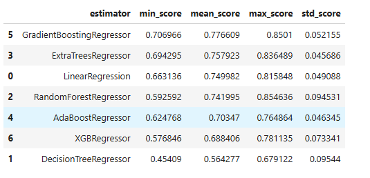

####	User Story: Perform an extensive search on the most suitable algorithms to find the best hyperparameter configuration

+ As a **data Analyst/data scientist**, I want to **utilize GridSearchCV to perform an extensive hyperparameter search, fitting and evaluating the two most suitable algorithms on my training data (GradientBoostingRegressor and ExtraTreesRegressor), so that **the optimal hyperparameter configuration for each model is identified.**

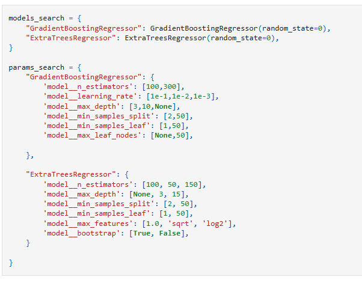

+ The reason behind this choice of hyperparameters was:

  GradientBoostingRegressor:
  + model__n_estimators: Number of boosting stages/trees; more trees generally improve performance but increase computation and risk overfitting.
  + model__learning_rate: Controls each tree's contribution; a smaller rate requires more estimators but makes the model more robust to overfitting.
  + model__max_depth: Maximum depth of individual trees; limits complexity to prevent overfitting and ensure weak learners.
  + model__min_samples_split: Minimum samples required to split a node; higher values prevent over-specialization and reduce overfitting.
  + model__min_samples_leaf: Minimum samples required at a leaf node; higher values smooth the model and reduce overfitting.
  + model__max_leaf_nodes: Limits the maximum number of terminal nodes; controls tree complexity as an alternative to max_depth.

  ExtraTreesRegressor:
  + model__n_estimators: Number of trees in the ensemble; more trees reduce variance and improve robustness through averaging.
  + model__max_depth: Maximum depth of individual trees; limits complexity, preventing individual trees from overfitting too much.
  + model__min_samples_split: Minimum samples required to split a node; higher values constrain the tree, reducing overfitting.
  + model__min_samples_leaf: Minimum samples required at a leaf node; higher values smooth the model and reduce overfitting.
  + model__max_features: Number of features to consider for best split; introduces randomness to decorrelate trees and reduce variance.
  + model__bootstrap: Whether bootstrap samples are used; adds randomness to tree building to reduce variance.

+ "ExtraTreesRegressor" was identified as the best-performing algorithm (Figure below)

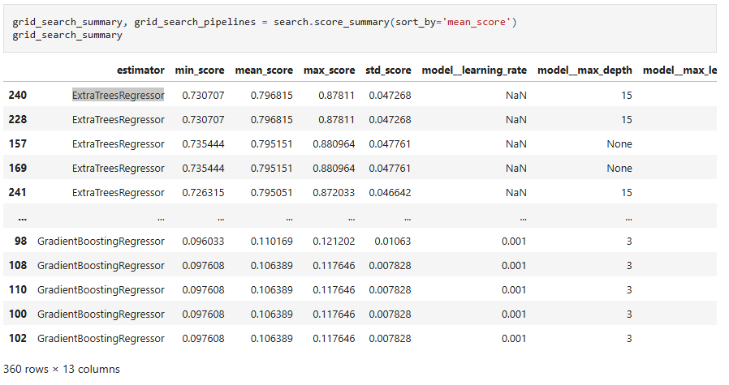

+ It achieved optimal results with the following hyperparameter configuration:

  + 'model__bootstrap': True
  + 'model__max_depth': 15
  + 'model__max_features': 'sqrt'
  + 'model__min_samples_leaf': 1
  + 'model__min_samples_split': 2
  + 'model__n_estimators': 100

#### User Story: Evaluate the ML Model Performance on the Train and Test Sets

+ As a **data Analyst/data scientist**, I want to **evaluate the Machine Learning ExtraTreesRegressor Model's performance on both the train and test sets using standard regression metrics (R2 score, Mean Squared Error, Mean Absolute Error), so that I can determine if the model achieves an R2 score greater than 0.75 on both sets, hence meeting the specified performance criteria.

  + Model evaluation showed that it indeed met the performance criteria:

    Train Set
    + R2 Score: 0.959
    + Mean Absolute Error: 11115.193
    + Mean Squared Error: 255344546.402
    + Root Mean Squared Error: 15979.504

    Test Set
    + R2 Score: 0.767
    + Mean Absolute Error: 25151.9
    + Mean Squared Error: 1607466342.169
    + Root Mean Squared Error: 40093.221

#### User Story: Assess feature importance

+ As a **data Analyst/data scientist**, I want to **identify the most influential features used by the trained model** so that **I can refit the pipeline with this reduced feature set, aiming to simplify the model and potentially improve its R2 performance.**

  + The 4 most important features in descending order were:'OverallQual, GarageArea, TotalBsmtSF and YearRemodAdd (Figure below).

  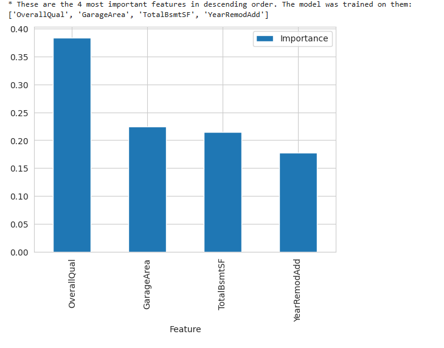
  
#### User Story: Refit the pipeline with best features

+ As a **data Analyst/data scientist**, I want to **refit the pipeline with the 4 identified best features,** so that **I can evaluate if the model's performance has improved.**

  + Model evaluation showed that the Model performance on the Test set improved, and thus, we successfully met the performance criteria of at least 0.75 on the train set as well as on the test set:
  
    Train Set
    + R2 Score: 0.959
    + Mean Absolute Error: 11087.997
    + Mean Squared Error: 252853242.072
    + Root Mean Squared Error: 15901.36

    Test Set
    + R2 Score: 0.778
    + Mean Absolute Error: 24805.924
    + Mean Squared Error: 1532760742.768
    + Root Mean Squared Error: 39150.488
  
  + Fullfillment of Business Requirement 2: With an R2 score of 0.959 on the training set and a robust 0.778 on the test set, our regression model has successfully met the defined performance criteria. This enables us to confidently state that the model accurately predicts house sale prices in Ames, Iowa, fulfilling Business Requirement 2.

### **Epic 6:**  Dashboard planning, designing, and development

#### User Story: Project Dashboard

+ As a **data Analyst/data scientist**, I want to **develop an interactive, clear, and easy-to-navigate dashboard** that contains the following pages:

  + Page 1 : A project summary page that introduces the project terms and jargon , the dataset and business requirements.
  + Page 2: The House Sales Price Study page that answers business requirement 1 and presents the visualizations described in Epic 2.
  + Page 3: The Predict House Sale Price page that answers business requirement 2 by displaying the "Total Predicted Sale Price" for the client's four inherited houses. This page also features interactive widgets for the four most important features: OverallQual, GarageArea, TotalBsmtSF, and YearRemodAdd (derived from Epic 5), collectively enabling the prediction of a sale price for any house in Ames, Iowa.
  + Page 4: A Project Hypothesis and Validation page that addresses the 3-project hypothesis and how they were validated.  
  + Page 5: The ML: House Sales Price page, that is a technical page dedicated to the Machine Learning regression model. It indicates the model's task, displays the ML pipeline after its refitting with the four best features (derived from Epic 5), and provides a detailed list and plot of these features. This page also explicitly displays the Pipeline Performance metrics: R2 score, Mean Squared Error, and Mean Absolute Error.

+ As a **the Client with the Inherited Houses**,  I want to **access an easy-to-use dashboard that shows relevant information in visuals and text regarding my business requirements**, so that I can **quickly understand which variables correlate the most with Sale Price, see the predicted sale price of my inherited houses, and/ or predict the sale price for any other houses in the Ames Iowa.**

### **Epic 7:** Dashboard deployment and release

+ As a **data Analyst/data scientist**, I want to **deploy the project dashboard to a reliable and accessible platform so that users and clients can seamlessly navigate all project pages and access insights without encountering technical issues.**

---

## Dashboard Design (Streamlit App User Interface)

+ The dashboard served as the user-facing interface of the Heritage Housing project. Built with [Streamlit](https://streamlit.io/), it presents predictions and insights in a clear, interactive, and accessible format—suitable for both technical and non-technical users.

+ Pages style: To enhance visual engagement and break monotony, an alternating green and blue color scheme has been applied to informational text blocks (utilizing st.success and st.info,). This color style is maintained consistently across all application pages.

### Page 1: Project summary

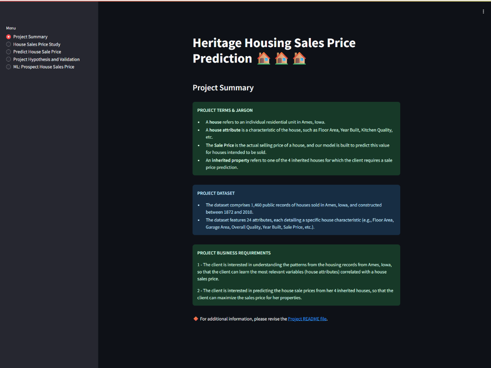

+ Project summary
+ Project Terms & Jargon
+ Describe Project Dataset
+ State Business Requirements
+ Link to ReadMe file in case User wants to see the full documentation

### Page 2: House Sales Price Study

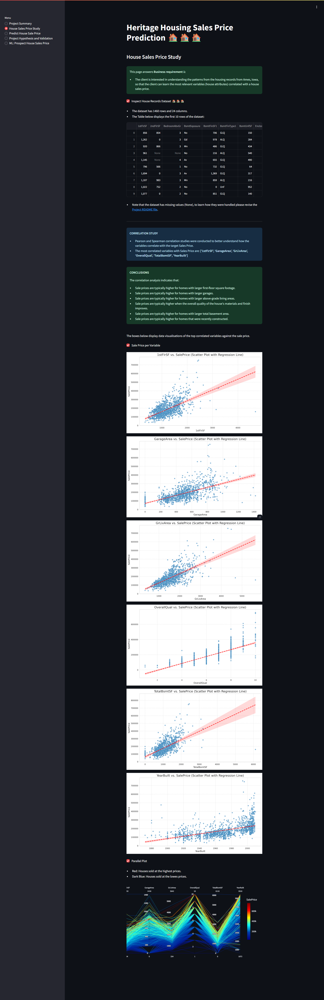

+ This page answers business requirement 1, but we couldn't know in advance which plots would need to be displayed.
+ Thus, after data analysis, we agreed with stakeholders that the page will:

  + State the page’s title.
  + State **business requirement 1**.
  + Include a **checkbox** allowing users to inspect the House Records Dataset . Toggling this option will:

    + Display the dataset’s dimensions (number of rows and columns in the data).
    + Display the first ten rows of the dataset.
    + Display a note below the table, informing the user about the presence of missing values and direct them to revisit this section for details on how they were handled.

  + Contain  an introduction to the **Correlation Study** that displays the most correlated variables to SalePrice.
  + Contain a summary of its **conclusions**.
  + Include a checkbox to display individual scatter plots, visualizing SalePrice levels against each of the most correlated variables. Scatter plots were selected as the appropriate visualization method because SalePrice and all identified 'most correlated variables' (1stFlrSF, GarageArea, GrLivArea, OverallQual, TotalBsmtSF, YearBuilt) can be considered continuous numerical variables, making them the most informative choice for illustrating these relationships (Figures below – Scatter Plots).

+ SalePrice vs 1stFlrSF
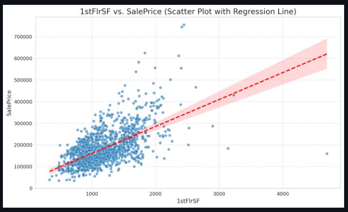

+ SalePrice vs GarageArea
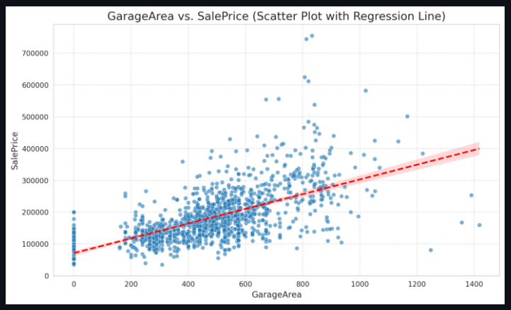

+ SalePrice vs GrLivArea
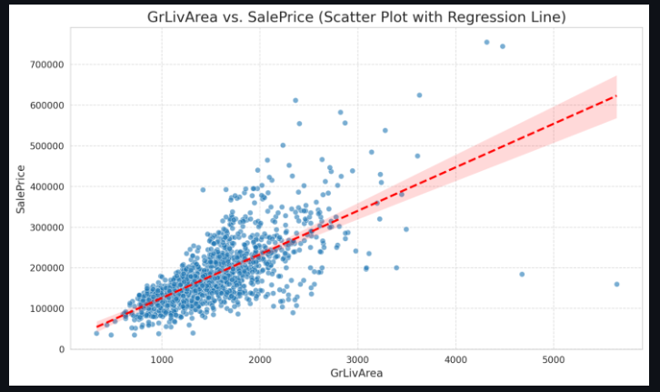

+ SalePrice vs OverallQual
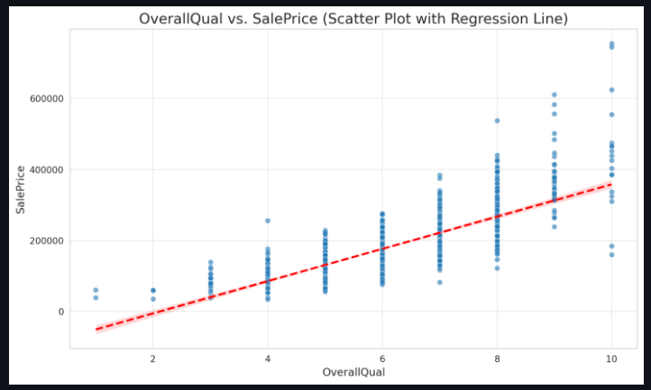

+ SalePrice vs TotalBsmtSF
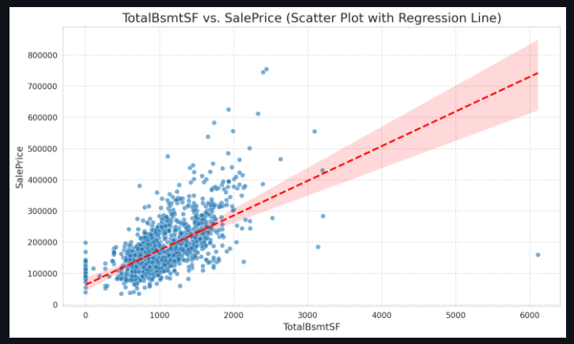

+ SalePrice vs YearBuilt
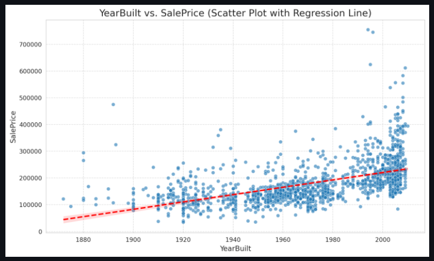

+ Include a Parallel coordinates plot featuring SalePrice and its correlated variables. This visualization offers a holistic understanding of how these key variables interact with SalePrice (Figure below – Parallel plot).
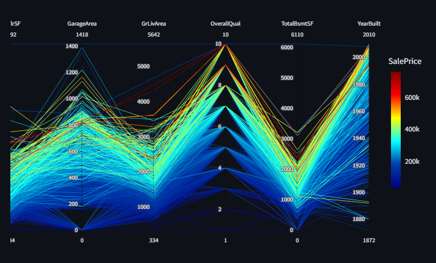

> [!NOTE]
> While not displayed on this page, it's important to note that missing values in the dataset were handled prior to conducting the correlation analysis.
>
> For **categorical variables (Objects)**: Missing entries were imputed with the label 'Missing', and this new 'Missing' category was included in subsequent evaluations.
>
> For **Numerical variables (Floats and Integers):** Given their non-normal distributions, missing values were imputed using the median of each respective variable."

### Page 3: House SalePrice Predictor

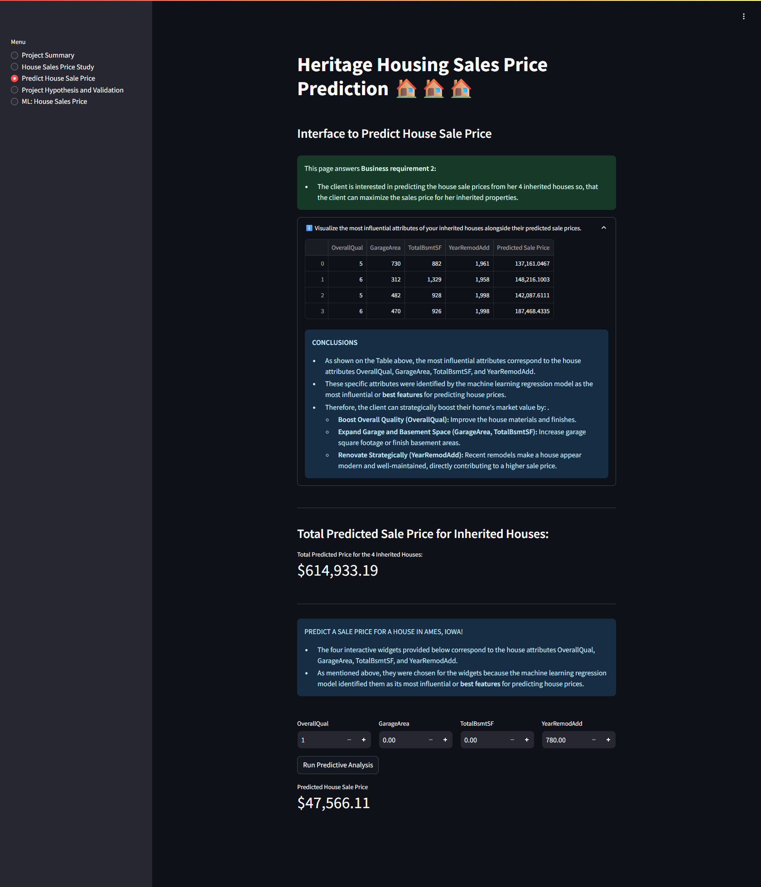

+ This page answers business requirement 2.
+ After creating and evaluating the ML model, we agreed with stakeholders that the page will:

  + State the page’s title.
  + State **business requirement 2**.
  + Include a collapsible box (st.expander) showcasing the most influential attributes (OverallQual, GarageArea, TotalBsmtSF, and YearRemodAdd) for the client's inherited houses, alongside their predicted SalePrices. These attributes were specifically identified by the machine learning regression model as the most impactful features (best features) for price prediction.

  + Contain a section that shows the summed predicted value (in dollars) of the four inherited properties.
  + Include a section enabling users to predict themselves the SalePrice for any house in Ames, Iowa. The prediction widgets correspond to the most influential features (OverallQual, GarageArea, TotalBsmtSF, and YearRemodAdd) identified by the machine learning model for predicting prospective SalePrice.
  + Include a "Run predictive analysis" button (st.button) that processes the users’ input through our ML pipeline and predicts the house SalePrice (in dollars).

### Page 4: Project Hypothesis and Validation

+ Before the analysis, we knew we wanted this page to describe each project hypothesis, the conclusions, and how we validated each. After the data analysis, we can report that:
  
HYPOTHESIS 1

+ We hypothesize that a property's size is a key driver of its sale with larger homes generally fetching higher SalePrices.
  + Correct: Our house SalePrice correlation study confirms the hypothesis that larger homes generally fetch higher prices and indicated that the variables (house attributes) 1stFlrSF, GarageArea, GrLivArea, and TotalBsmtSF are the most influential variables in their correlation with SalePrice.

HYPOTHESIS 2

+ A recent survey showed that recently remodeled houses are perceived as more valuable.
  + Correct: Correlation analysis placed YearRemodAdd within the top 10 variables for both Pearson and Spearman correlations with SalePrice. Interestingly, however, YearBuilt exhibited a stronger individual correlation. Nonetheless, the subsequent feature importance analysis from our machine learning pipeline confirmed YearRemodAdd as a significant and influential predictor within the model. These combined results collectively suggest that the survey's observation about the increased perceived value of remodeled houses is likely accurate.

HYPOTHESIS 3

+ We hypothesize that a higher OverallQual rating (indicating superior overall material and finish) will directly correlate with increased house SalePrices.
  + Correct: Correlation studies consistently placed OverallQual within the top 5 variables for both Pearson and Spearman correlations with SalePrice. Furthermore, our machine learning pipeline's feature importance analysis identified OverallQual as the most important predictor among the model's influential features. Therefore, our hypothesis that a higher OverallQual rating directly correlates with increased house SalePrices is strongly supported by our analysis and the insights derived from our machine learning model.

### Page 5: Predict SalePrice

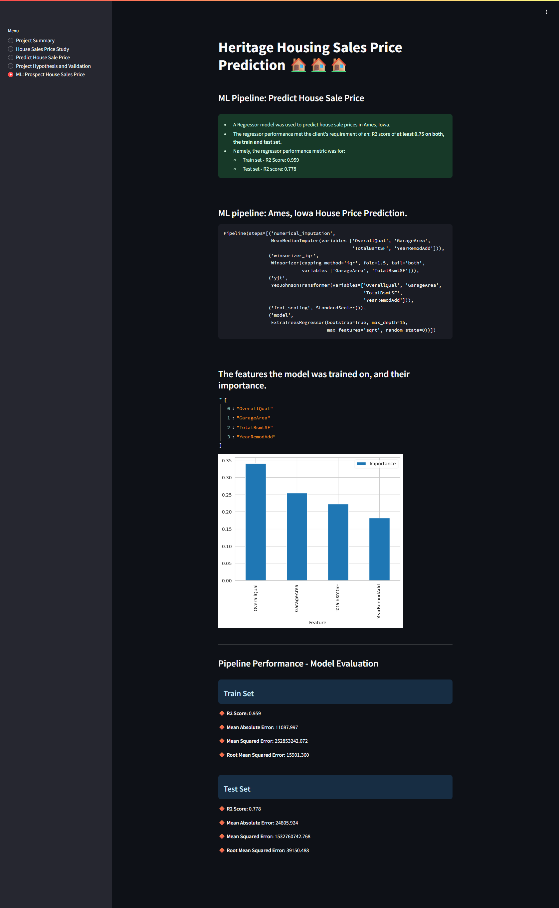

+ Considerations and conclusions after the pipeline is trained
+ Present ML pipeline steps
+ Feature importance
+ Pipeline performance

---

## CRISP-DM Methodology

This project adhered to the Cross-Industry Standard Process for Data Mining (CRISP-DM) methodology throughout all its phases from Business Understanding to Deployment. This well-established framework provided a structured and iterative roadmap, crucial for the successful development of this machine learning-based system.
The detailed procedures documented below from Data Understanding to evaluation can be found in the [Jupyter notebooks](https://github.com/ParedesGab/PP5-heritage-housing-issues/tree/main/jupyter_notebooks)

The adoption of the CRISP-DM framework provided a structured, systematic, and iterative approach crucial for developing this robust system. This methodology was instrumental in enabling data-driven decision-making, ensuring scalability and continuous improvement, and ultimately establishing a highly valuable and adaptable solution for large-scale farm management.

---

## Unfixed Bugs

+ Deployment to Heroku did not work due to the compiled lug size, which was larger than the max permitted (500 M).
  + Solution: Deployment was peformed using the [Render](https://render.com/) platform instead.

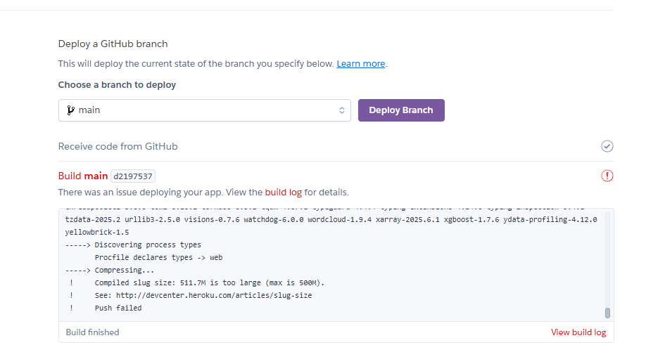

> [!IMPORTANT]
> There are no remaining bugs that I am aware of, though, even after thorough testing, I cannot rule out the possibility.

---

## Deployment

### Render

+ The App live link is: <https://pp5-heritage-housing-issues-gp.onrender.com>
+ The project was deployed to [Render](https://render.com/) using the following steps:
  
  1. Log in to Render with GitHub.
  2. Click “New +” and then Click “Web Service”.
  3. Search for relevant repo and click “Connect”.
  4. Add a project Name. Note, if the name is not unique, a random hash with be appended to the name given.
  5. Ensure the following settings match:
     + Root Directory: blank
     + Language: Python 3
     + Region: Frankfurt (EU Central)
     + Branch: main

  6. Set the Build Command as pip install -r requirements.txt && ./setup.sh
  7. Set the Set the Start Command as streamlit run app.py
  8. For this project I selected the Free plan $0/month.
  9. Scroll down and Click “Add Environment Variable”
     + Add a Add a key: PORT and a value: 8501
     + Add a second environment variable with a key: PYTHON_VERSION and value: 3.12.1

  10. Select Auto Deployment: On Commit (so that the site deploys every time a commit is pushed to the GitHub repository).
  11. Click “Create Web Service”
  12. Wait for deployment (the deployment took around 8 min to complete)
  13. Once the deployment is completed a Build successful 🎉message appears
  14. Open the [deployed site link](https://pp5-heritage-housing-issues-gp.onrender.com) positioned link below the WEB SERVICE name.
  15. Run the program to check that it all works as expected.

## Local Deployment

### Forking

To have a copy of the project in your repositories:

1. Log in or sign up to GitHub.
2. Navigate to the [project repository](https://github.com/ParedesGab/PP5-heritage-housing-issues).
3. In the top right corner, click the "Fork" button.
4. A new page titled "Create a new fork" will appear. Optionally, you can edit the repository name.
5. At the bottom of the page, click "Create fork."

### Cloning

1. Log in or sign up to GitHub.
2. Go to the [project repository](https://github.com/ParedesGab/PP5-heritage-housing-issues).
3. Click the green button "Code" and choose your preferred cloning method (for example: HTTPS, SSH, or GitHub CLI) and copy the provided url.
4. Open the terminal in your preferred code editor and change the current working directory to the one where you want the cloned directory
5. Run git clone in the terminal, paste the copied link, and press Enter.

---

## Languages, Modules and Libraries and Other Technologies Used

### Languages

+ Python: A popular, high-level programming language used for web development, data analysis, AI, and machine learning models.

### Modules

+ os: A built-in Python module that provides a portable way of interacting with the operating system.

### Libraries

+ Pandas: A powerful Python library for data manipulation and analysis.
+ NumPy: A fundamental Python library for numerical computing, especially with arrays.
+ ydata-profiling: A Python library for automated exploratory data analysis.
+ ProfileReport: A class from ydata-profiling that generates comprehensive data profiles.
+ feature_engine: A Python library for advanced feature engineering and preprocessing.
+ CategoricalImputer: A feature_engine transformer that imputes missing values in + categorical features.
+ MeanMedianImputer: A feature_engine transformer that imputes missing numerical values with the mean or median.
+ OneHotEncoder: A feature_engine transformer that converts categorical features into one-hot encoded numerical arrays.
+ DropFeatures: A feature_engine transformer that drops specified features from a dataset.
transformation (as vt) vt.YeoJohnsonTransformer: A feature_engine transformer that applies the Yeo-Johnson power transformation to numerical features.
+ Winsorizer: A feature_engine transformer that caps outliers at a specified maximum or minimum value.
+ OrdinalEncoder: A feature_engine transformer that encodes categorical features as ordinal integers.
+ SmartCorrelatedSelection: A feature_engine transformer that selects features based on their correlation.
+ pingouin: A Python library for statistical analysis.
+ Seaborn: A Python library for statistical data visualization, built on Matplotlib.
+ Matplotlib: A comprehensive Python library for creating static, animated, and interactive visualizations.
+ Matplotlib.pyplot: A collection of command-style functions in Matplotlib that make it work like MATLAB.
+ Plotly.express: A high-level API for creating interactive plots with Plotly.
+ ppscore: A Python library that calculates the Predictive Power Score (PPS) between two columns.
+ warnings: A built-in Python module for warning control.
+ sklearn.model_selection: A scikit-learn module providing tools for splitting data, cross-validation, and hyperparameter tuning.
+ SciKit-Learn: A comprehensive Python library for machine learning modelling, including splitting, scaling, training, and more.
+ scipy.stats: A SciPy module containing a large number of probability distributions and statistical functions.
+ sklearn: (See SciKit-Learn) A powerful Python library for machine learning.
+ Pipeline (from sklearn): A scikit-learn utility that chains multiple processing steps into a single estimator.
+ StandardScaler (from sklearn): A scikit-learn preprocessor that standardizes features by removing the mean and scaling to unit variance.
+ SelectFromModel (from sklearn): A scikit-learn meta-transformer that selects features based on importance weights from a trained model.
+ DecisionTreeRegressor: A scikit-learn model that uses a tree structure for regression tasks.
+ GradientBoostingRegressor: A scikit-learn ensemble model that builds an additive model in a forward stage-wise fashion.
+ RandomForestRegressor: A scikit-learn ensemble model that fits a number of decision tree regressors on various sub-samples of the dataset.
+ LinearRegression: A scikit-learn model that fits a linear model for regression tasks.
+ AdaBoostRegressor: A scikit-learn ensemble meta-estimator that fits a regressor on the original dataset and then fits additional copies of the regressor on the same dataset but where the weights of instances are adjusted.
+ GridSearchCV (from sklearn): A scikit-learn utility for exhaustive search over specified parameter values for an estimator.
+ sklearn.metrics r2_score, mean_squared_error, mean_absolute_error: Scikit-learn functions for evaluating regression model performance.
+ ExtraTreesRegressor (from sklearn): A scikit-learn ensemble model that fits a number of randomized decision trees on various sub-samples of the dataset.
+ xgboost: An optimized distributed gradient boosting library designed to be highly efficient, flexible, and portable.
+ XGBRegressor: The XGBoost implementation for regression tasks.
+ joblib: A Python library for pipelining Python jobs, particularly useful for caching and parallel computing.
+ Streamlit: A Python library that turns data scripts into shareable web applications.

### Other Technologies Used

+ GitHub: A web-based platform for version control and collaboration, primarily for software development.
+ Microsoft Excel: A spreadsheet program used for data organization, analysis, and visualization.
+ Jupyter Notebook: An open-source web application that allows you to create and share documents containing live code, visualizations, and narrative text.

---

## Future Implementations

+ The SmartCorrelatedSelection step in Notebook 4-FeatureEngineering used a 0.6 threshold. It would be beneficial to experiment with this threshold to better understand and address multicollinearity within the dataset.

+ As a future experiment, I would like to explore a classification approach to sales price prediction. This would involve discretizing the continuous sales price into pre-defined ranges (e.g., "low," "medium," "high") and then training a classification model. This shift would allow to assess performance using classification-specific metrics and algorithms, offering a different analytical lens, albeit sacrificing the exact price prediction of a regression model.
  
+ Explore unsupervised machine learning techniques, such as clustering, to identify natural groupings among the house records from Ames, Iowa, based on their characteristics.

+ Pearson and Spearman correlation highlighted YearBuilt's strong relationship with SalePrice. However, YearBuilt was eliminated during the SmartCorrelatedSelection phase of the regression pipeline, with YearRemod ultimately being selected as a top feature by SelectFromModel. Therefore, I am interested in refitting the pipeline while explicitly retaining YearBuilt to further assess its contribution.
  
+ Customize visualizations of top correlated variables against SalePrice for enhanced clarity. For instance, YearBuilt's relationship with SalePrice could be better represented using a linear plot instead of a scatter plot.

---

## Credits

### Code

+ This project used the fictious dataset [Housing Prices Data](https://www.kaggle.com/datasets/codeinstitute/housing-prices-data), created by [Code Institute](https://codeinstitute.net/global/), and sourced from [Kaggle](https://www.kaggle.com/).

+ The Jupyter notebooks and application pages incorporate logic and code significantly influenced by the Code Institute [Churnometer walkthrough project](https://github.com/Code-Institute-Solutions/churnometer). However, I carefully revised and adapted were necessary the code for this project, applying analytical thinking to determine each step.

+ The following functions from the [Churnometer project](https://github.com/Code-Institute-Solutions/churnometer) were utilized in my project:
  + EvaluateMissingData function; DisplayCorrAndPPS; CalculateCorrAndPPS; heatmap_pps; heatmap_corr; DataCleaningEffect; plot_histogram_and_boxplot; FeatureEngineeringAnalysis; check_user_entry_on_analysis_type; check_missing_values; define_list_column_transformers; apply_transformers; DiagnosticPlots_Categories; DiagnosticPlots_Numerical; FeatEngineering_CategoricalEncoder; FeatEngineering_OutlierWinsorizer; FeatEngineering_Numerical.

  + Please note, that any modifications made to the Code Institute functions are specified in the respective notebook.
  
+ The choice of hyperparameters for ExtraTreesRegressor and GradientBoostingRegressor relied heavily on the official Scikit-learn documentation (links provided below) and relevant [Code Institute](https://codeinstitute.net/global/) study materials.

  + [GradientBoostingRegressor](https://scikit-learn.org/stable/modules/generated/sklearn.ensemble.GradientBoostingRegressor.html)
  + [ExtraTreesRegressor](https://scikit-learn.org/stable/modules/generated/sklearn.ensemble.ExtraTreesRegressor.html)

### Images

+ All images in the ReadMe are screenshots directly from my live project application or the Jupyter notebooks.

## Acknowledgements

+ Thank you very much to my cohort Kay Welfare for the important tips!

+ Than you the Code Institute Tutor Team for showing me the guidelines to deploy in Render.

+ To my family, especially my husband Johannes, my parents Hildebrando and Marcela and my siblings Brando and Sandra: thank you for all your support and cheering on this project. It means the world.

+ This project marks the fifth and final Portfolio Project of my journey with Code Institute. I want to extend my sincere gratitude to Code Institute for providing comprehensive and foundational learning materials, instrumental in developing this predictive analytics application and my other 4 projects within my Portfolio. My gratitude also goes out to all the Code Institute members who were incredibly supportive throughout this journey. It was a truly fantastic experience; you've done an outstanding job teaching and dissecting complex topics, making this learning journey both fun and memorable!
